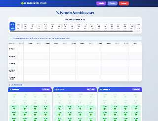
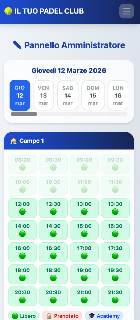
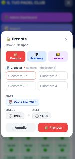
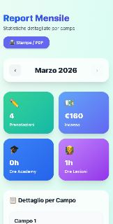

<p align="center">
  
  
  
  
  
</p>

<h1 align="center">🎾 Padel Club Manager</h1>

<p align="center">
  <strong>Una piattaforma completa per la gestione di un club di padel.</strong><br/>
  Prenotazione campi, gestione tornei, pannello admin e report mensili — tutto in un'unica web app moderna e responsive.
</p>

<p align="center">
  <a href="#-features">Features</a> •
  <a href="#-screenshots">Screenshots</a> •
  <a href="#%EF%B8%8F-tech-stack">Tech Stack</a> •
  <a href="#-getting-started">Getting Started</a> •
  <a href="#-struttura-progetto">Struttura</a> •
  <a href="#-api-endpoints">API</a>
</p>

---

## ✨ Features

### 👤 Area Utente
- **Registrazione e login** con autenticazione JWT (commentata nel codice)
- **Prenotazione campi** con visualizzazione disponibilità in tempo reale (slot da 1h30min)
- **Dashboard personale** con le proprie prenotazioni e possibilità di cancellazione
- **Iscrizione tornei** — singola o in coppia, con ricerca partner e registrazione ospiti 
- **Notifiche email** automatiche quando si viene aggiunti a una partita

### ⚙️ Pannello Amministratore
- **Timeline interattiva** con vista giornaliera per tutti i campi (indoor + outdoor)
- **Gestione prenotazioni** — blocco slot, academy 🎓, lezioni private 👨‍🏫
- **Slider 21 giorni** per navigare rapidamente tra le date
- **Riepilogo giornaliero** con dettaglio eventi per campo
- **Gestione giocatori** — lista completa, ruoli, livelli

### 🏆 Gestione Tornei (commentata nel codice)
- **Creazione e configurazione** tornei con campi, orari e livello
- **Gestione coppie** con teste di serie e gironi
- **Tabellone automatico** — fase Gold 🥇 e Silver 🥈 con aggiornamento risultati live
- **Iscrizioni self-service** per gli utenti dalla dashboard

### 📊 Report & Analytics
- **Report mensile** con KPI cards: prenotazioni, incasso, ore Academy, ore Lezioni
- **Dettaglio per campo** con statistiche e revenue
- **Grafico prenotazioni per giorno** 
- **Dettaglio lezioni coach** con note e ore per sessione
- **Export PDF / Stampa** integrato

### 🤝 Sponsor (commentata nel codice)
- Gestione sponsor con logo, link e ordinamento
- Footer dinamico visibile su tutte le pagine

---

## 📱 Screenshots

<table>
  <tr>
    <td align="center" width="50%">
      <br/>
      <strong>Admin Dashboard — Desktop</strong><br/>
      <sub>Timeline interattiva, slider giorni e griglia slot per campo</sub>
    </td>
    <td align="center" width="50%">
      <br/>
      <strong>Admin Dashboard — Mobile</strong><br/>
      <sub>Layout mobile-first con griglia compatta 4 colonne</sub>
    </td>
  </tr>
  <tr>
    <td align="center" width="50%">
      <br/>
      <strong>Prenotazione Campo</strong><br/>
      <sub>Modal di prenotazione con tipo (Prenota/Academy/Lezione), giocatori e orario</sub>
    </td>
    <td align="center" width="50%">
      <br/>
      <strong>Report Mensile</strong><br/>
      <sub>KPI cards con prenotazioni, incasso, ore Academy e Lezioni</sub>
    </td>
  </tr>
</table>

---

## 🛠️ Tech Stack

| Layer | Tecnologia |
|-------|-----------|
| **Frontend** | React 18, Vite 7, Tailwind CSS 3.4, React Router 6 |
| **Backend** | Node.js, Express, Mongoose |
| **Database** | MongoDB Atlas |
| **Auth** | JWT (jsonwebtoken + bcryptjs) |
| **Email** | Nodemailer (SMTP) |
| **Calendar** | FullCalendar (opzionale, componente timeline) |
| **Deploy** | Vercel (frontend), qualsiasi hosting Node (backend) |

---

## 🚀 Getting Started

### Prerequisiti

- **Node.js** >= 18
- **MongoDB** (locale o Atlas)
- Un account SMTP per le notifiche email (opzionale)

### 1. Clona il repository

```bash
git clone https://github.com/your-username/PC-PadelProject.git
cd PC-PadelProject
```

### 2. Configura il Backend

```bash
cd backend
npm install
```

Crea un file `.env` nella cartella `backend/`:

```env
MONGO_URI=mongodb+srv://<user>:<password>@cluster.mongodb.net/<db-name>
JWT_SECRET=your-super-secret-key
PORT=4000

# Email (opzionale)
SMTP_HOST=smtp.gmail.com
SMTP_PORT=587
SMTP_SECURE=false
SMTP_USER=your-email@gmail.com
SMTP_PASS=your-app-password

# App
APP_URL=http://localhost:5173

# Club config (opzionale — sovrascrive i valori di default in config.js)
CLUB_NAME=Il Tuo Padel Club
CLUB_SLOT_PRICE=40
```

Avvia il server:

```bash
npm run dev    # con nodemon (sviluppo)
# oppure
node server.js # produzione
```

### 3. Configura il Frontend

```bash
cd frontend
npm install
```

Crea un file `.env.local` nella cartella `frontend/`:

```env
VITE_API_URL=http://localhost:4000
```

Avvia il dev server:

```bash
npm run dev
```

L'app sarà disponibile su `http://localhost:5173`.

### 4. Inizializza i campi

Alla prima esecuzione, apri nel browser:

```
http://localhost:4000/api/init
```

Questo crea i campi configurati in `backend/config.js`.

---

## 📂 Struttura Progetto

```
PC-PadelProject/
├── backend/
│   ├── models/
│   │   ├── Booking.js        # Prenotazioni utente
│   │   ├── BlockedSlot.js    # Slot admin (prenotazioni/academy/lezioni)
│   │   ├── Court.js          # Campi (indoor/outdoor)
│   │   ├── Player.js         # Giocatori/utenti
│   │   ├── Tournament.js     # Tornei con gironi e tabellone
│   │   └── Sponsor.js        # Sponsor del club
│   ├── config.js             # Configurazione club (campi, orari, prezzi)
│   ├── server.js             # API Express (tutto in un file)
│   └── .env                  # Variabili d'ambiente
│
├── frontend/
│   ├── src/
│   │   ├── pages/
│   │   │   ├── Login.jsx           # Login
│   │   │   ├── Register.jsx        # Registrazione
│   │   │   ├── Dashboard.jsx       # Dashboard utente
│   │   │   ├── Book.jsx            # Prenotazione campo
│   │   │   ├── AdminDashboard.jsx  # Pannello admin
│   │   │   ├── AdminTournaments.jsx# Gestione tornei
│   │   │   └── Report.jsx          # Report mensile
│   │   ├── components/
│   │   │   ├── NavBar.jsx
│   │   │   ├── CourtTimeline.jsx
│   │   │   ├── CourtTimelineDashboard.jsx
│   │   │   ├── CourtTimelineBook.jsx
│   │   │   └── SponsorFooter.jsx
│   │   └── App.jsx
│   └── .env.local            # URL API
│
└── docs/screenshots/          # Screenshot per README
```

---

## 📡 API Endpoints

### Auth
| Metodo | Endpoint | Descrizione |
|--------|----------|-------------|
| `POST` | `/api/register` | Registrazione nuovo utente |
| `POST` | `/api/login` | Login e ottenimento token JWT |

### Courts
| Metodo | Endpoint | Descrizione |
|--------|----------|-------------|
| `GET` | `/api/courts` | Lista campi |
| `GET` | `/api/slots/:courtId?date=YYYY-MM-DD` | Slot disponibili per campo e data |
| `GET` | `/api/availability` | Disponibilità globale (bookings + blocked) |

### Bookings
| Metodo | Endpoint | Descrizione |
|--------|----------|-------------|
| `GET` | `/api/bookings` | Le tue prenotazioni |
| `POST` | `/api/bookings` | Crea prenotazione (1h / 1h30min) |
| `PATCH` | `/api/bookings/:id/players` | Aggiungi giocatori |
| `PATCH` | `/api/bookings/:id/cancel` | Cancella prenotazione |

### Admin
| Metodo | Endpoint | Descrizione |
|--------|----------|-------------|
| `GET` | `/api/admin/bookings` | Tutte le prenotazioni attive |
| `GET` | `/api/admin/report?month=M&year=Y` | Report mensile |
| `POST` | `/api/blocked-slots` | Blocca slot (prenota/academy/lezione) |
| `GET` | `/api/admin/players` | Lista giocatori |

### Tornei
| Metodo | Endpoint | Descrizione |
|--------|----------|-------------|
| `GET` | `/api/tournaments/public` | Tornei aperti (utenti) |
| `POST` | `/api/tournaments` | Crea torneo (admin) |
| `POST` | `/api/tournaments/:id/draw` | Genera tabellone |
| `POST` | `/api/tournaments/:id/couples` | Aggiungi coppia |

---

## ⚙️ Configurazione Club

Tutti i parametri del club sono personalizzabili in `backend/config.js` o via variabili d'ambiente:

| Parametro | Default | Descrizione |
|-----------|---------|-------------|
| `CLUB_NAME` | C.T. LATIANO | Nome del club |
| `CLUB_SLOT_PRICE` | 40 | Prezzo per slot (€) |
| `CLUB_SLOT_DURATION` | 90 | Durata slot (minuti) |
| `CLUB_OPEN_HOUR` | 8 | Ora apertura |
| `CLUB_CLOSE_HOUR` | 22 | Ora chiusura |

I campi sono definiti nell'array `courts` di `config.js`:

```javascript
courts: [
  { name: "Campo 1", type: "indoor", order: 1 },
  { name: "Campo 2", type: "indoor", order: 2 },
  { name: "Campo 3", type: "indoor", order: 3 },
  { name: "Campo 4 Esterno", type: "outdoor", order: 4 },
  { name: "Campo 5 Esterno", type: "outdoor", order: 5 },
]
```

---

## 📄 License

Questo progetto è open source e disponibile sotto la licenza [MIT](LICENSE).

---

<p align="center">
  Made with ❤️ for the padel community 🎾
</p>
